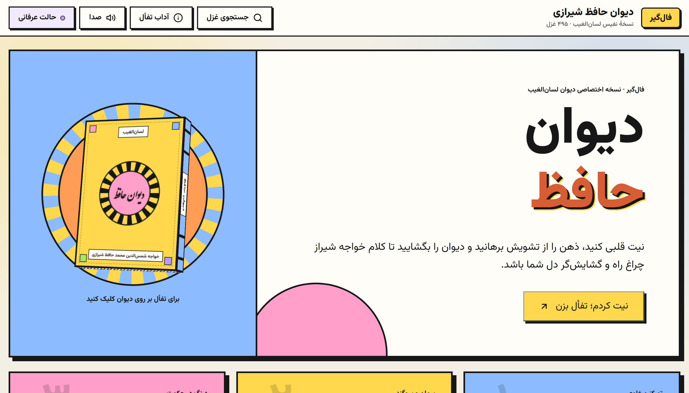

<div align="center">

# فال‌گیر (FalGir)

**سامانه تعاملی تفأل به دیوان حافظ شیرازی با شبیه‌سازی سه‌بعدی، خط اصیل نستعلیق و معماری نئوبروتالیسم**

<br />



<br /><br />

[](LICENSE)
[](https://developer.mozilla.org/en-US/docs/Web/JavaScript)
[](https://developer.mozilla.org/en-US/docs/Web/CSS)
[](falnama.json)
[](index.html)
[](https://ramin-mahmoodi.github.io/FalGir/)

**[مشاهده پیش‌نمایش زنده (Live Demo)](https://ramin-mahmoodi.github.io/FalGir/)**

</div>

---

## فهرست مطالب (Table of Contents)
- [معرفی پروژه](#معرفی-پروژه)
- [ویژگی‌های کلیدی](#ویژگیهای-کلیدی)
- [طراحی و هویت بصری (Neo-Brutalist & Bento Grid)](#طراحی-و-هویت-بصری)
- [معماری سه‌بعدی دیوان (CSS 3D Transforms)](#معماری-سهبعدی-دیوان)
- [موتور سنتز صدا (Web Audio API)](#موتور-سنتز-صدا-web-audio-api)
- [ساختار فایل‌ها](#ساختار-فایلها)
- [راهنمای نصب و اجرای محلی](#راهنمای-نصب-و-اجرای-محلی)
- [کلیدهای میانبر](#کلیدهای-میانبر-keyboard-shortcuts)
- [منابع و سپاسگزاری](#منابع-و-سپاسگزاری)
- [مجوز](#مجوز-license)

---

## معرفی پروژه

**فال‌گیر (FalGir)** یک وب‌اپلیکیشن مستقل، سریع و مدرن است که سنت کهن تفأل به دیوان لسان‌الغیب، خواجه شمس‌الدین محمد حافظ شیرازی را در فضایی تعاملی و چشم‌نواز بازآفرینی می‌کند. این پروژه هنر کتاب‌آرایی و خوشنویسی اصیل ایرانی را با اصول مدرن طراحی وب (Neo-Brutalism و Bento Grid) و شبیه‌سازی هندسی سه‌بعدی پیوند زده است.

کل پروژه به صورت **کاملاً Vanilla (بدون هیچ فریم‌ورک جاوااسکریپتی، کتابخانه خارجی یا ابزار بیلد)** توسعه داده شده است. بارگذاری فوق‌العاده سریع، واکنش‌گرایی دقیق در انواع صفحه‌نمایش‌ها (از گوشی‌های ۳۶۰ پیکسل تا مانیتورهای بزرگ دسکتاپ) و عدم وابستگی به سرور از شاخصه‌های فنی فال‌گیر است.

---

## ویژگی‌های کلیدی

### ۱. آیین تعاملی تورق و افشای فال (Divination Ritual Sequence)
- **مرحله ۱ (نیت و آرامش ذهن):** نمایش دیوان بسته در مرکز دایره چرخان با بازخورد نوری، همراه با طنین صوتی کاسه تبتی روی فرکانس آرامش‌بخش ۴۳۲ هرتز.
- **مرحله ۲ (تورق پیوسته اوراق):** جلد دیوان ۱۸۰ درجه گشوده شده و برگه‌های کتاب با شماره غزل‌های واقعی دیوان و ابیات متقارن به صورت متوالی و روان ورق می‌خورند.
- **مرحله ۳ (نمایان شدن غزل):** نمایش غزل نهایی با خط چشم‌نواز **ایران‌نستعلیق**، تفکیک آراسته مصرع‌ها با نشان ستاره زرین (✦) و کادربندی‌های دقیق.
- **مرحله ۴ (تعبیر و مقصود فال):** ارائه پیام و حکمت غزل در قالبی خوانا و رسا با قلم **وزیرمتن**.

### ۲. بانک اطلاعاتی جامع ۴۹۵ غزل
- متن کامل و تصحیح‌شده تمامی ۴۹۵ غزل دیوان حافظ به همراه تعبیر اختصاصی و کاربردی برای تک‌تک غزل‌ها در فایل سبُک و سریع `falnama.json`.

### ۳. ابزارهای تعاملی و کاربردی
- **جستجوی هوشمند و دسترسی مستقیم:** امکان جستجوی بلادرنگ در اشعار بر اساس واژگان، مطلع غزل یا شماره غزل با سیستم جستجوی بدون لگ.
- **حالت عرفانی (Dream Mode):** قابلیت تغییر تم به حالت عرفانی با رنگ‌بندی تیره و آرامش‌بخش و فرکانس صوتی ۵۲۸ هرتز.
- **کپی شکیل متن شعر:** کپی ساختاریافته مطلع، شماره، ابیات و تعبیر فال با یک کلیک همراه با اعلان هوشمند (Toast).
- **اشتراک‌گذاری بومی (Web Share API):** امکان ارسال و اشتراک مستقیم فال در پیام‌رسان‌ها (تلگرام، واتس‌اپ و...) در موبایل.
- **طرح اختصاصی چاپ (Print Stylesheet):** قالب اختصاصی بهینه‌شده برای چاپ کاغذی یا خروجی PDF بی‌پیرایه و تمیز از غزل و تعبیر.
- **آداب و تاریخچه تفأل:** پنجره راهنمای معنوی نیت، تاریخچه لقب لسان‌الغیب و دعای سنتی پیش از گشودن دیوان.

---

## طراحی و هویت بصری

فال‌گیر از زبان طراحی جسورانه و مدرن **نئو-بروتالیسم (Neo-Brutalism)** در ترکیب با چیدمان شبکه‌ای **بنتو (Bento Grid)** بهره می‌برد:
- **کنتراست صریح و قاطع:** خطوط محیطی مشکی پررنگ (`2.5px solid #171717`)، سایه‌های سخت بدون تاریکی تدریجی و زوایای کاملاً هندسی.
- **پالت رنگی پویا و سرزنده:** ترکیب زرد خورشیدی، آبی آسمانی، بنفش کم‌رنگ، صورتی هلویی و سبز پاستلی الهام‌گرفته از نقوش سنتی کاشی‌کاری ایرانی در قالبی نوین.
- **حلقه گردان خورشیدی (Sun Ring):** دایره پرتویی با حرکت دورانی نرم در پس‌زمینه دیوان که حس طالع و گردش افلاک را تداعی می‌کند.

---

## معماری سه‌بعدی دیوان

دیوان سه‌بعدی حافظ در این پروژه بدون استفاده از موتورهای سنگین مانند Three.js، صرفاً با **CSS 3D Transforms** خالص خلق شده است:
- **عطف یکپارچه و لولای دقیق:** اتصال بی‌نقص جلد رو، عطف آبی‌رنگ و جلد پشت در ضخامت استاندارد ۳۶ پیکسل، بدون هرگونه درز یا فاصله غیرفیزیکی.
- **مسدودسازی کامل نشت صفحات در حالت بسته:** اوراق داخلی تا زمان شروع انیمیشن باز شدن به صورت قطعی در پشت جلد مهار شده و هیچ متن یا برگه سفیدی از کناره‌های جلد به بیرون نشت نمی‌کند.
- **سازگاری هندسی بدون تغییر شکل در موبایل:** تثبیت نسبت‌های هندسی دیوان با سیستم مقیاس‌بندی وکتوری، به‌طوری که کتاب در باریک‌ترین نمایشگرهای تلفن همراه نیز کاملاً متقارن و یکپارچه باقی می‌ماند.

---

## موتور سنتز صدا (Web Audio API)

تمامی افکت‌های صوتی در فال‌گیر به صورت **الگوریتمی و روی مرورگر کاربر** توسط نوسان‌سازهای ریاضی تولید می‌شوند؛ **بدون دانلود حتی یک فایل صوتی**:
1. **نوای کاسه تبتی (Singing Bowl):** سنتز فرکانس‌های پایه ۴۳۲ هرتز (حالت عادی) و ۵۲۸ هرتز (حالت عرفانی) همراه با اُورتون‌های هارمونیک و میرایی ملایم نمایی.
2. **آکورد پرده‌برداری غزل:** پرده‌های صوتی دلنشین در لحظه آشکار شدن شعر.
3. **تنظیم وضعیت صدا:** دکمه قطع/وصل صدا در نوار بالایی با ذخیره‌سازی وضعیت کاربر در `localStorage`.

---

## ساختار فایل‌ها

```text
FalGir/
├── index.html          # ساختار معنایی HTML5، نشانه‌گذاری سه‌بعدی کتاب و پنجره‌ها
├── style.css           # طراحی نئو-بروتالیست، معماری سه‌بعدی، پالت رنگ و مدیا کوئری‌ها
├── script.js           # منطق تفأل، موتور صوتی Web Audio، انیمیشن تورق و جستجو
├── falnama.json        # بانک اطلاعاتی کامل ۴۹۵ غزل همراه با تعابیر
├── assets/
│   ├── preview.png     # تصویر پیش‌نمایش رابط کاربری پروژه
│   └── fonts/          # فونت‌های وب
│       ├── IranNastaliq.woff2
│       ├── Vazirmatn-Regular.woff2
│       └── Vazirmatn-Bold.woff2
└── README.md           # مستندات و شناسنامه جامع پروژه
```

---

## راهنمای نصب و اجرای محلی

از آنجا که پروژه مستقل از هرگونه وابستگی است، اجرای آن بسیار ساده است:

### ۱. کلون کردن مخزن
```bash
git clone https://github.com/ramin-mahmoodi/FalGir.git
cd FalGir
```

### ۲. اجرای یک وب‌سرور سبک محلی
به دلیل بارگذاری فایل دیتابیس `falnama.json` با متد `fetch`، مرورگرها برای رعایت سیاست‌های امنیتی (CORS) نیازمند سرور محلی هستند:

**با استفاده از پایتون (ساده‌ترین روش):**
```bash
python -m http.server 8000
```
سپس آدرس `http://localhost:8000` را در مرورگر باز کنید.

**یا با استفاده از Node.js:**
```bash
npx serve .
```

**یا با اکستنشن Live Server در VS Code:**
روی فایل `index.html` راست‌کلیک کرده و **Open with Live Server** را بزنید.

---

## کلیدهای میانبر (Keyboard Shortcuts)

<table width="100%">
  <thead>
    <tr>
      <th width="35%" align="center">کلید میانبر</th>
      <th width="65%" align="right">عملکرد</th>
    </tr>
  </thead>
  <tbody>
    <tr>
      <td align="center"><kbd>Space</kbd> یا <kbd>Enter</kbd></td>
      <td align="right">شروع نیت و اجرای تفأل به دیوان</td>
    </tr>
    <tr>
      <td align="center"><kbd>Esc</kbd></td>
      <td align="right">بستن پنجره‌های باز (جستجو یا آداب تفأل)</td>
    </tr>
    <tr>
      <td align="center"><kbd>M</kbd></td>
      <td align="right">قطع یا وصل کردن صدای زمینه و جلوه‌ها</td>
    </tr>
  </tbody>
</table>

---

## منابع و سپاسگزاری

- **بانک اشعار و تعابیر:** با تقدیر از مجموعه ارزشمند [HafezFaalDatabase](https://github.com/mahmoud-eskandari/HafezFaalDatabase).
- **قلم فاخر ایران‌نستعلیق:** اثر گران‌قدر شورای عالی اطلاع‌رسانی.
- **قلم وزیرمتن:** اثر ماندگار زنده‌یاد صابر راستی‌کردار (یادش همیشه گرامی).

---

## مجوز (License)

این پروژه تحت مجوز نرم‌افزاری آزاد **[MIT](LICENSE)** منتشر شده است و استفاده شخصی و تجاری، اصلاح، بازنشر و توسعه آن با رعایت شرایط این مجوز بلامانع است.
